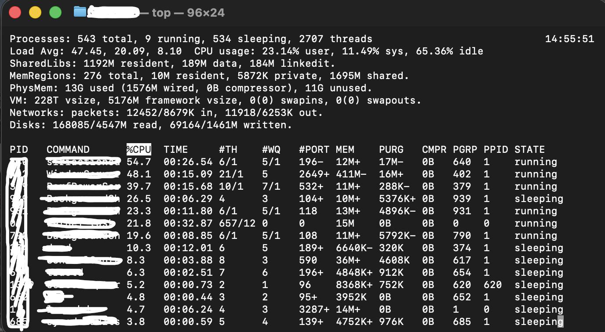
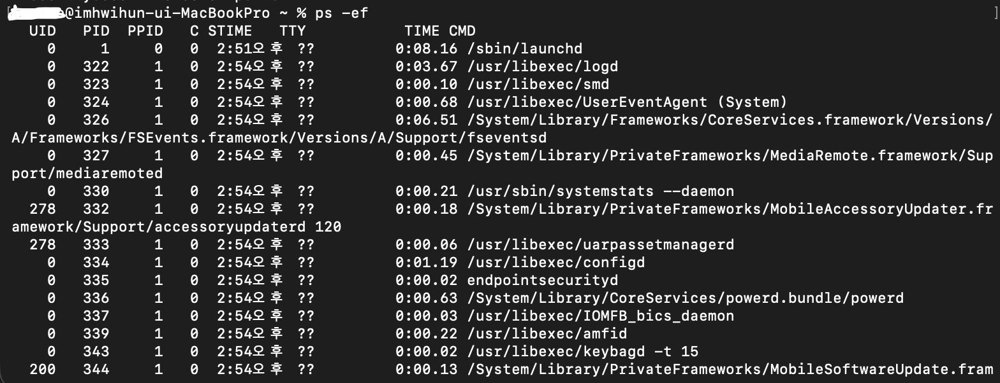
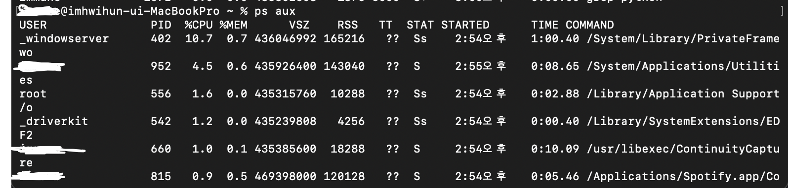
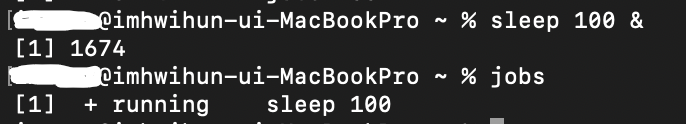
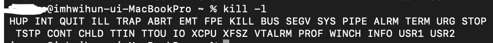
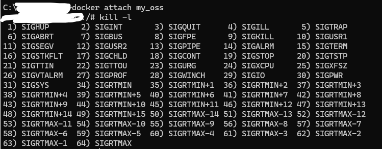

# 📌 Linux Process Management Commands

`top` · `ps` · `jobs` · `kill` 설명 문서
> by. 조선대학교 컴퓨터공학과 20234889 임휘훈

## 📖 목차
1. [개요](#📝-개요)
2. [명령어 요약](#명령어-요약)
3. [명령어 상세](#명령어-상세)
    - [top](#top)
    - [ps](#ps)
    - [jobs](#jobs)
    - [kill](#kill)

## 📝 개요
***Linux*** 환경에서 **프로세스**를 관리할 때 가장 많이 사용하는 명령어 **`top`**, **`ps`**, **`jobs`**, **`kill`** 을 정리한 문서입니다.

각 명령어의 **목적, 사용 예시, 주요 옵션, 출력 예제** 등을 ***Markdown*** 기능을 활용하여 보기 쉽게 구성하였습니다.

## 🔍 명령어 요약
| 명령어 | 역할 | 특징 |
|:-----:|:------|:------|
| **`top`** | 실시간 프로세스 모니터링 | CPU·메모리 점유율 확인, 동적 화면 |
| **`ps`** | 프로세스 목록 출력 | 정적인 출력, 스냅샷 형태 |
| **`jobs`** | 백그라운드 작업 목록 확인 | 쉘 단위의 작업 관리 |
| **`kill`** | 프로세스 종료 신호 전송 | SIGTERM, SIGKILL 등 다양한 시그널 지원 |

---

## 명령어 상세
## 🟦 top 
### 개요
`top`은 **실시간** ***(real-time)*** 으로 시스템 상태를 모니터링하는 명령어이다.

서버의 CPU 사용률이나 메모리 사용률을 볼 수 있고, CPU 사용이 많은 순서대로 프로세스 목록을 보여준다.
- 현재 시스템의 CPU 사용률
- 메모리 사용량
- 실행 중인 프로세스 리스트
- Load Average (1분, 5분, 15분)
- 각 프로세스의 CPU/메모리 점유율

### 옵션
| 옵션 | 설명 |
|:----:|----|
| `-o` | 정렬 기준 변경 |
| `-b` | 출력 결과를 파일이나 다른 프로그램으로 전달 (Log용) |
| `-p <pid>` | 특정 PID만 표시 |

### 사용 예시
`top`

### 사용 예시 화면

---

## 🟧 ps 
### 개요
`ps`는 Process Status의 약자로 **현재 사용자가 실행 중인 프로세스의 상태, 목록**을 출력한다. (스냅샷)

### 옵션
| 옵션 | 설명 |
|:----:|---|
| `-e`, `-A` | 모든 프로세스 표시 (다른 사용자 포함) |
| `-f` | 상세한 정보 표시 |
| `aux` | 현재 시스템에서 실행중인 모든 프로세스를 상세한 형식 |

### 사용예시
`ps aux | grep python`

### 사용 예시 화면
- `ps -ef`

- `ps aux`

- `ps aux | grep python`

### 옵션 설명 및 필드 설명
`-e`와 `-f`는 `-ef`로 주로 함께 사용한다. 프로세스간의 관계(부모-자식), 프로세스가 시작된 시간(STIME) 같은 정보는 `-ef`를 사용한다.
`aux` **시스템 리소스(CPU, 메모리)** 사용 현황을 빠르게 확인할 수 있다.

### ps 출력 필드 설명 (통합 표)

| 항목 / 상태 | 의미 |
|:------------:|-------|
| **USER / UID** | 프로세스를 실행한 사용자명 / 사용자 ID |
| **PID** | 프로세스 ID |
| **PPID** | 부모 프로세스 ID |
| **TT, TTY** | 프로세스를 실행한 터미널 |
| **%CPU** | CPU 사용률 |
| **%MEM** | 메모리 사용률 |
| **TIME** | 누적 CPU 사용 시간 |
| **START** | 프로세스 시작 시각 |
| **COMMAND, CMD** | 실행된 명령어 |
| **SIZE** | 가상 메모리 사용량 (text + data + stack) |
| **RSS** | 실제 물리 메모리 사용량 |
| **FLAGS** | 프로세스 플래그 |
| **NI (Nice)** | 프로세스 우선순위 값 |
| **WCHAN** | 프로세스가 대기 중인 커널 함수 |
| **PAGEIN** | 페이지 폴트(page fault) 횟수 |
| **TSIZ** | 텍스트(text) 메모리 크기 |
| **DSIZ** | 데이터(data) 메모리 크기 |
| **LIM** | 메모리 제한 |
| **STAT (상태)** | 프로세스 상태 코드 |
| `R` | 실행 가능 상태(Runnable) |
| `S` | 슬립 상태(Sleeping) |
| `D` | 디스크 I/O 대기 상태 |
| `T` | 정지됨(Stopped) |
| `Z` | 좀비(Zombie) |
| **STAT 보조 정보** | |
| `<` | 높은 우선순위 |
| `N` | 낮은 우선순위 |
| `L` | 메모리 락(lock) 페이지 존재 |
| `s` | 세션 리더(Session leader) |
| `l` | 멀티 스레드 프로세스 |

---

## 🟩 jobs 
### 개요
현재 쉘에서 실행 중인 **백그라운드/정지된 작업**을 보여준다. 이를 통해 사용자는 각 작업의 작업 번호를 확인하고, 이를 기반으로
프로세스 관련 명령어를 사용하여 작업을 관리(전환, 종료)할 수 있다.

### 옵션
| 옵션 | 설명 |
|:----:|-----|
| `-l` | 각 작업의 **프로세스 ID** ***(PID)*** 도 **함께** 출력 |
| `-p` | 각 작업의 **프로세스 ID**만 출력 |
| `-r` | **실행 중** ***(Running)*** 인 작업만 출력 |
| `-s` | **일시 중지된 작업**만 출력 |

### 사용 예시
`jobs`

### 사용 예시 화면

#### 1. `sleep 100 &`
- `sleep 100` : 100초 동안 아무것도 안 하고 기다리는 프로그램
- `&` : 이 명령을 **백그라운드**에서 실행

#### 2. `jobs`

| 요소 | 의미 |
|:----:|:----:|
| `[1]` | Job ID |
| `+` | 기본 job |
| `running` | 실행 중 |
| `sleep 100` | 실행된 명령 |

## 🟥 kill 
### 개요
프로세스에 시그널을 보내 종료하는 명령어

### 옵션
| 옵션 | 설명 |
|:-----:|:---:|
| `-l` | 시그널 목록 출력 |
| `-s [Number Or Signal]`, `-[Number Or Signal]` | 보낼 시그널 지정 |

### 시그널
| 시그널 | 번호 | 설명 |
|:-----:|:----:|-----|
| `SIGHUP` | 1 | 종료 (연결 끊기) |
| `SIGINT` | 2 | 종료 (CTRL + C, 인터럽트) |
| `SIGKILL` | 9 | 강제 종료 |
| `SIGTERM` | 15 | 정상 종료 |

### 사용 예시
`kill -9 12345`

### 사용 예시 화면 (macOS vs Linux)
#### 1. macOS (Darwin / BSD 계열)

- macOS는 **BSD 계열** `kill`을 사용한다.
- `kill -l`이 **신호 이름만** 공백으로 나열해서 출력한다. 번호가 보이지 않지만 앞에서부터 1, 2, 3..

#### 2. Linux (Docker 컨테이너 Ubuntu)

- Linux는 보통 GNU coreutils / glibc의 `kill`을 사용한다.
- `kill -l`이 `번호) 시그널`형식으로 출력된다.